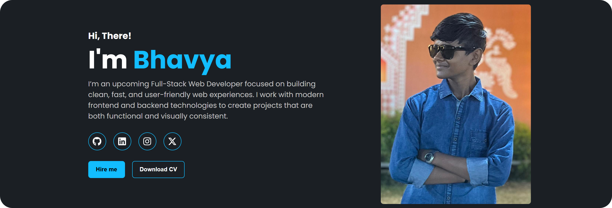

  
  
  
  

A clean and responsive personal portfolio website showcasing my projects, skills, and learning journey as a beginner full-stack web developer.  
Built using **HTML, CSS, and Bootstrap**.

  <a href="https://bhavyuh.github.io/Portfolio/">Preview</a>

## 📚 Table of Contents
- [Technologies Used](#-technologies-used)
- [Credits](#-credits)

## 🛠 Technologies Used
- HTML5
- CSS3
- Bootstrap 5

## 🙏 Credits

- Reference template: [Sudharsan's Portfolio](https://danielace1.github.io/Portfolio)
